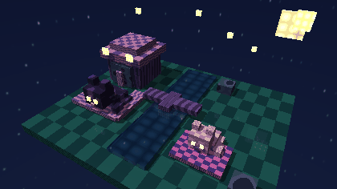

# Proyecto 2: Diorama nocturno de gatos con Raytracing

Proyecto en Rust para construir un pequeno diorama nocturno, cute y relacionado a gatos, usando cubos texturizados con raytracing.

## Objetivo

Crear una escena tipo diorama con materiales distintos, reflexion, refraccion, skybox, rotacion de la escena y control de zoom de camara.

La escena final es una islita nocturna con dos gatos de cubos, ojos brillantes, luna, estrellas, agua reflectiva/refractiva, casita y paleta morada/azul.

## Restricciones

- Se usa `minifb` como excepcion autorizada por el profesor para abrir una ventana y visualizar el render.
- El proyecto se desarrolla en fases y cada fase debe quedar en un commit separado.
- La entrega final debe incluir un video del diorama en este README.

## Plan por fases

1. **Base del proyecto**
   - Inicializar Cargo, Git y README.
   - Por que: deja una base limpia y verificable antes de implementar el raytracer.

2. **Raytracer minimo**
   - Implementar vectores, rayos, camara, color y salida a imagen PPM.
   - Por que: primero necesitamos comprobar que podemos generar imagenes sin depender de librerias externas.

3. **Cubos y texturas**
   - Agregar interseccion con cubos y texturas procedurales por material.
   - Por que: el diorama se evalua con cubos texturizados, parecido a bloques tipo Minecraft.

4. **Diorama completo**
   - Construir una escena con piso, paredes, objetos y al menos 5 materiales.
   - Por que: cubre complejidad visual y prepara la parte subjetiva de la nota.

5. **Efectos de raytracing**
   - Agregar iluminacion, sombras, reflexion, refraccion y skybox.
   - Por que: estos son puntos directos de la rubrica y hacen la escena mas atractiva.

6. **Camara y animacion**
   - Implementar rotacion del diorama y zoom de camara; renderizar frames.
   - Por que: la rubrica pide rotacion y acercamiento/alejamiento, y esos frames serviran para el video.

7. **Pulido y entrega**
   - Ajustar composicion, rendimiento, README, instrucciones y enlace/video final.
   - Por que: deja el proyecto listo para GitHub y para calificacion.

## Como ejecutar

```bash
cargo run
```

Esto abre una ventana con `minifb`.

Controles:

- `A` / `D` o flechas izquierda/derecha: rotar alrededor del diorama.
- `W` / `S` o flechas arriba/abajo: acercar y alejar la camara.
- `R`: reiniciar la camara.
- `Esc`: cerrar la ventana.

Para renderizar sin abrir ventana:

```bash
cargo run -- --no-window
```

Para generar frames de una animacion orbital con zoom:

```bash
cargo run -- --frames 60
```

Los frames quedan en:

```text
frames/frame_0000.ppm
frames/frame_0001.ppm
...
```

Si tienes `ffmpeg`, puedes convertirlos a video asi:

```bash
ffmpeg -framerate 12 -i frames/frame_%04d.ppm -pix_fmt yuv420p diorama_gatos.mp4
```

Si no tienes `ffmpeg`, abre la ventana con `cargo run` y graba la pantalla mientras rotas el diorama.

La Fase 1 genera una imagen PPM en:

```text
renders/fase1_cielo.ppm
```

La Fase 2 genera cubos texturizados en:

```text
renders/fase2_cubos.ppm
```

La Fase 3 genera el diorama con cinco materiales en:

```text
renders/fase3_diorama.ppm
```

La Fase 4 agrega sombras, reflexion, refraccion y skybox procedural en:

```text
renders/fase4_efectos.ppm
```

La Fase 5 agrega rotacion interactiva y zoom de camara en la ventana con `minifb`.
Tambien guarda la vista inicial en:

```text
renders/fase5_interactivo.ppm
```

La version final nocturna de gatos se guarda en:

```text
renders/final_gatos_nocturnos.ppm
```

## Video



## Estado

- [x] Fase 0: base del proyecto
- [x] Fase 1: raytracer minimo
- [x] Fase 2: cubos y texturas
- [x] Fase 3: diorama completo
- [x] Fase 4: efectos de raytracing
- [x] Fase 5: camara y animacion
- [x] Fase 6: pulido y entrega
